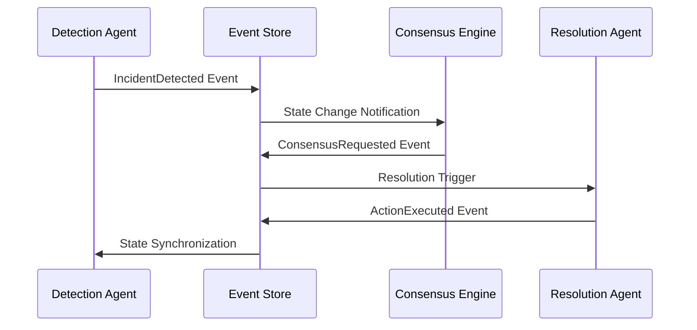

# Design Document

## Overview

The Autonomous Incident Commander is a multi-agent orchestration platform built on AWS Bedrock AgentCore that provides zero-touch incident resolution for cloud infrastructure. The system employs a swarm intelligence architecture where five specialized agents (Detection, Diagnosis, Prediction, Resolution, Communication) collaborate through a sophisticated consensus engine to autonomously detect, analyze, and resolve incidents.

The architecture follows event-driven patterns with distributed state management, ensuring resilience and scalability. The system targets sub-3-minute mean time to resolution (MTTR) while maintaining enterprise-grade security, compliance, and observability.

## Architecture

### AWS-Native System Architecture

```mermaid
graph TB
    subgraph "External Data Sources"
        CW[CloudWatch Metrics]
        DD[Datadog API]
        PD[PagerDuty API]
        SLACK[Slack API]
        LOGS[Application Logs]
    end

    subgraph "Incident Commander System"
        subgraph "Agent Layer"
            DA[Detection Agent]
            DIA[Diagnosis Agent]
            PA[Prediction Agent]
            SRA[Secure Resolution Agent]
            CA[Communication Agent]
        end

        subgraph "Distributed Orchestration Layer"
            SF[Step Functions Consensus]
            AS[Agent Swarm Coordinator]
            CB[Circuit Breaker]
            RT[Reasoning Tracer]
            DPC[Deadlock Prevention]
        end

        subgraph "Scalable Data Layer"
            KDS[Kinesis Data Streams]
            DDB[DynamoDB Events]
            OS[OpenSearch Serverless]
            BIC[Business Impact Calculator]
            SV[Security Validator]
        end

        subgraph "AWS Infrastructure Layer"
            BR[Bedrock Runtime]
            BRL[Bedrock Rate Limiter]
            SSM[Session Manager]
            S3[S3 Archive Storage]
            IAM[Just-in-Time IAM]
        end
    end

    subgraph "Monitoring & Demo"
        SHM[System Health Monitor]
        DC[Demo Controller]
        DASH[Real-time Dashboard]
    end

    CW --> DA
    DD --> DA
    LOGS --> DIA
    DA --> SF
    DIA --> SF
    PA --> SF
    SF --> SRA
    SRA --> SSM
    SRA --> IAM
    SRA --> CA
    CA --> PD
    CA --> SLACK
    KDS --> DDB
    DDB --> OS
    SHM --> KDS
    DC --> AS
    BRL --> BR
```



**Architecture Improvements:**

- **Step Functions Consensus**: Eliminates single point of failure in consensus engine
- **Kinesis + DynamoDB**: Prevents race conditions with ordered event streaming
- **OpenSearch Serverless**: Scales RAG memory to millions of incidents
- **Session Manager**: Provides secure, audited resolution execution
- **Just-in-Time IAM**: Minimizes privilege escalation risks
- **Bedrock Rate Limiter**: Intelligent model routing and request prioritization

### Multi-Agent Coordination Pattern

The system implements a **hierarchical swarm intelligence** pattern with three coordination layers:

1. **Agent Layer**: Specialized agents with domain expertise
2. **Consensus Layer**: Conflict resolution and decision coordination
3. **Orchestration Layer**: Workflow management and state coordination

### Event-Driven State Management

All system state changes flow through an event sourcing pattern:



## Components and Interfaces

### Agent Specifications

#### Robust Detection Agent

**Purpose**: Identify and classify incidents with defensive programming against alert storms
**Technology**: AWS Bedrock Claude-3 with intelligent sampling and circuit breakers
**Interfaces**:

- Input: CloudWatch metrics, Datadog API, application logs (with backpressure handling)
- Output: Structured incident classifications with confidence bounds and data quality metrics
- SLA: 2-minute detection, 95% accuracy, <2% false positives, handles 50K+ alert storms

**Defensive Architecture**:

```python
class RobustDetectionAgent:
    def __init__(self):
        self.alert_sampler = AlertSampler(max_rate=100)  # Sample high-volume alerts
        self.correlation_cache = TTLCache(maxsize=10000, ttl=300)
        self.anomaly_baseline = RollingBaseline(window_hours=24)
        self.max_correlation_depth = 5
        self.analysis_timeout = 30  # Hard timeout

    async def analyze_with_backpressure(self, metrics_stream):
        # Handle alert storms with intelligent sampling
        sampled_alerts = await self.alert_sampler.sample_with_priority(metrics_stream)

        # Handle clock skew and data lag
        normalized_alerts = await self.normalize_timestamps(sampled_alerts)

        # Correlation with circuit breaker
        try:
            correlations = await asyncio.wait_for(
                self.correlate_with_cache(normalized_alerts),
                timeout=self.analysis_timeout
            )
        except asyncio.TimeoutError:
            # Fallback to simple threshold detection
            return await self.simple_threshold_detection(sampled_alerts)

        return await self.classify_with_confidence_bounds(correlations)

    async def handle_partial_data_scenario(self, available_sources: List[str]):
        """Handle scenarios where monitoring infrastructure is degraded"""
        confidence_penalty = 0.0

        if "cloudwatch" not in available_sources:
            confidence_penalty += 0.3  # Major penalty
        if "datadog" not in available_sources:
            confidence_penalty += 0.2
        if len(available_sources) < 2:
            confidence_penalty += 0.4  # Very low confidence

        return max(0.1, base_confidence - confidence_penalty)
```

**Core Algorithms**:

- Intelligent alert sampling with priority-based filtering
- Time-bounded correlation analysis with circuit breakers
- Confidence adjustment based on data source availability
- Defensive parsing against malformed monitoring data

#### Hardened Diagnosis Agent

**Purpose**: Analyze root causes with protection against infinite loops and data corruption
**Technology**: AWS Bedrock with bounded RAG analysis and defensive parsing
**Interfaces**:

- Input: Incident context, sanitized logs, traces, historical patterns (with size limits)
- Output: Root cause analysis with evidence chains, confidence scores, and corruption detection
- SLA: 5-minute analysis with structured diagnostic reports, handles 1TB+ log volumes

**Defensive Architecture**:

```python
class HardenedDiagnosisAgent:
    def __init__(self):
        self.max_log_size = 100 * 1024 * 1024  # 100MB limit
        self.correlation_depth_limit = 5
        self.analysis_timeout = 180  # 3 minutes hard limit
        self.visited_incidents = set()  # Prevent circular references

    async def investigate_with_bounds(self, incident_context):
        # Prevent infinite loops
        if incident_context.id in self.visited_incidents:
            raise CircularReferenceError(f"Already analyzing {incident_context.id}")

        self.visited_incidents.add(incident_context.id)

        try:
            # Size-bounded log analysis
            relevant_logs = await self.sample_logs_by_relevance(
                incident_context.logs,
                max_size=self.max_log_size
            )

            # Depth-limited correlation
            correlations = await self.correlate_with_depth_limit(
                relevant_logs,
                max_depth=self.correlation_depth_limit
            )

            # Time-bounded RAG search
            similar_patterns = await asyncio.wait_for(
                self.rag_memory.search_excluding_current(
                    incident_context,
                    exclude_ids=[incident_context.id]
                ),
                timeout=60
            )

            return await self.synthesize_diagnosis(correlations, similar_patterns)

        finally:
            self.visited_incidents.remove(incident_context.id)

    async def handle_corrupted_logs(self, log_stream):
        """Handle malformed, binary, or malicious log data"""
        sanitized_logs = []

        for log_entry in log_stream:
            try:
                # Validate JSON structure
                if isinstance(log_entry, str):
                    parsed = json.loads(log_entry)

                # Size limits
                if len(str(log_entry)) > 10000:  # 10KB per log entry
                    continue

                # Schema validation
                if self.validate_log_schema(parsed):
                    sanitized_logs.append(parsed)

            except (json.JSONDecodeError, UnicodeDecodeError):
                # Skip malformed entries, don't crash
                continue
            except Exception:
                # Don't let any log entry crash the agent
                continue

        return sanitized_logs
```

**Core Algorithms**:

- Bounded causal inference with depth limits
- Defensive log parsing with size and schema validation
- Circular reference detection for RAG memory queries
- Statistical significance testing for correlation filtering

#### Prediction Agent

**Purpose**: Forecast potential incidents and recommend preventive actions
**Technology**: AWS Bedrock with time-series analysis models
**Interfaces**:

- Input: Real-time metrics, trend data, historical patterns
- Output: Incident predictions with 15-30 minute advance warning
- SLA: 80% prediction accuracy with 90-minute advance notice

**Core Algorithms**:

- Time-series forecasting using LSTM networks
- Trend analysis with seasonal decomposition
- Risk assessment using Monte Carlo simulation

#### Secure Resolution Agent

**Purpose**: Execute automated remediation actions with zero-trust security validation
**Technology**: AWS Bedrock with Session Manager and just-in-time credentials
**Interfaces**:

- Input: Consensus recommendations, diagnostic context, security validation
- Output: Executed actions, rollback procedures, success validation
- SLA: 10-minute execution with 5-minute regression monitoring

**Security Architecture**:

```python
class SecureResolutionAgent:
    def __init__(self):
        self.session_manager = boto3.client('ssm')
        self.sandbox_account = os.environ['SANDBOX_ACCOUNT_ID']
        self.prod_account = os.environ['PROD_ACCOUNT_ID']

    async def execute_action_with_validation(self, action: ResolutionAction) -> ActionResult:
        # 1. Always test in sandbox first
        sandbox_result = await self.execute_in_sandbox(action)
        if not sandbox_result.success:
            raise ActionValidationError(f"Sandbox test failed: {sandbox_result.error}")

        # 2. Use just-in-time credentials with minimal scope
        temp_credentials = await self.get_jit_credentials(action.required_permissions)

        # 3. Execute with session recording
        session_id = await self.start_recorded_session(action.target_resources)

        try:
            result = await self.execute_with_credentials(action, temp_credentials)

            # 4. Immediate validation
            validation_result = await self.validate_action_success(action, result)
            if not validation_result.success:
                await self.auto_rollback(action, session_id)

            return result
        finally:
            await self.revoke_credentials(temp_credentials)
            await self.end_recorded_session(session_id)

    async def get_jit_credentials(self, required_permissions: List[str]) -> TemporaryCredentials:
        # Create minimal IAM role for specific action
        policy_document = {
            "Version": "2012-10-17",
            "Statement": [
                {
                    "Effect": "Allow",
                    "Action": required_permissions,
                    "Resource": "*",
                    "Condition": {
                        "StringEquals": {
                            "aws:RequestedRegion": os.environ['AWS_REGION']
                        }
                    }
                }
            ]
        }

        # Assume role with 15-minute expiration
        return await self.sts.assume_role(
            RoleArn=f"arn:aws:iam::{self.prod_account}:role/IncidentCommander-JIT-{uuid.uuid4()}",
            RoleSessionName="incident-resolution",
            DurationSeconds=900,  # 15 minutes
            Policy=json.dumps(policy_document)
        )
```

**Core Algorithms**:

- Zero-trust action validation with sandbox testing
- Just-in-time privilege elevation with time-boxed credentials
- Automated rollback with dependency tracking
- Session recording for complete audit trails

#### Resilient Communication Agent

**Purpose**: Handle notifications with deduplication and rate limiting protection
**Technology**: AWS Bedrock with timezone-aware communication and notification batching
**Interfaces**:

- Input: Incident status, stakeholder preferences, escalation policies (with deduplication)
- Output: Notifications via Slack, PagerDuty, email with ordered delivery and rate limiting
- SLA: 10-second notifications with real-time status updates, handles notification storms

**Defensive Architecture**:

```python
class ResilientCommunicationAgent:
    def __init__(self):
        self.notification_deduplicator = DeduplicationCache(ttl=300)
        self.channel_rate_limiters = {
            "slack": RateLimiter(1, burst=5),  # 1/sec, burst 5
            "pagerduty": RateLimiter(2, burst=10),
            "email": RateLimiter(10, burst=50)
        }
        self.timezone_manager = TimezoneManager()

    async def notify_with_deduplication(self, incident_update):
        # Prevent duplicate notifications
        notification_key = f"{incident_update.incident_id}:{incident_update.status}:{incident_update.severity}"

        if self.notification_deduplicator.contains(notification_key):
            return  # Skip duplicate notification

        self.notification_deduplicator.add(notification_key)

        # Route based on severity and timezone
        stakeholders = await self.get_relevant_stakeholders(incident_update)

        # Batch notifications to prevent rate limiting
        notification_batches = self.batch_by_channel(stakeholders)

        for channel, batch in notification_batches.items():
            await self.send_batch_with_rate_limiting(channel, batch)

    async def handle_out_of_order_updates(self, incident_updates):
        """Ensure status updates are delivered in correct order"""
        # Sort by timestamp and sequence number
        ordered_updates = sorted(
            incident_updates,
            key=lambda u: (u.timestamp, u.sequence_number)
        )

        for update in ordered_updates:
            # Check if this update is newer than last sent
            last_sent = await self.get_last_sent_update(update.incident_id)

            if last_sent and update.sequence_number <= last_sent.sequence_number:
                continue  # Skip outdated update

            await self.send_ordered_update(update)

    async def respect_do_not_disturb(self, stakeholder, incident_severity):
        """Handle timezone-aware notifications and DND policies"""
        local_time = self.timezone_manager.get_local_time(stakeholder.timezone)

        # Check do-not-disturb hours
        if stakeholder.dnd_hours.contains(local_time.hour):
            # Only send critical alerts during DND hours
            if incident_severity < IncidentSeverity.CRITICAL:
                await self.queue_for_business_hours(stakeholder, incident)
                return

        # Check escalation policies
        escalation_level = self.calculate_escalation_level(
            incident_severity,
            local_time
        )

        await self.send_with_escalation_level(stakeholder, incident, escalation_level)
```

**Core Algorithms**:

- Notification deduplication with time-based caching
- Channel-specific rate limiting with intelligent batching
- Timezone-aware escalation with do-not-disturb policies
- Ordered message delivery with sequence number tracking

### Byzantine Fault Tolerant Consensus Engine

The Consensus Engine uses **AWS Step Functions** with Byzantine fault detection to handle compromised agents:

```python
class DistributedConsensusOrchestrator:
    AGENT_WEIGHTS = {
        "detection": 0.2,
        "diagnosis": 0.4,
        "prediction": 0.3,
        "resolution": 0.1
    }

    def __init__(self):
        self.step_functions = boto3.client('stepfunctions')
        self.consensus_state_machine_arn = os.environ['CONSENSUS_STATE_MACHINE_ARN']

    async def initiate_consensus(self, recommendations: List[AgentRecommendation]) -> ConsensusResult:
        # Use Step Functions for distributed consensus with automatic retries
        execution = await self.step_functions.start_execution(
            stateMachineArn=self.consensus_state_machine_arn,
            input=json.dumps({
                "recommendations": [r.to_dict() for r in recommendations],
                "agent_weights": self.AGENT_WEIGHTS,
                "timeout_seconds": 120,
                "confidence_threshold": 0.7,
                "incident_severity": self.get_incident_severity()
            })
        )

        return await self.wait_for_consensus_result(execution['executionArn'])

class ByzantineFaultTolerantConsensus:
    def __init__(self):
        self.integrity_checker = AgentIntegrityChecker()
        self.behavior_analyzer = BehaviorAnalyzer()
        self.min_trusted_agents = 3  # Need majority for consensus

    async def detect_compromised_agents(self, recommendations):
        """Detect agents providing malicious or inconsistent recommendations"""
        suspicious_agents = []

        for rec in recommendations:
            # Check for impossible confidence scores
            if rec.confidence > 1.0 or rec.confidence < 0.0:
                suspicious_agents.append(rec.agent_name)
                continue

            # Check for behavior anomalies
            if await self.behavior_analyzer.is_anomalous(rec):
                suspicious_agents.append(rec.agent_name)
                continue

            # Verify agent integrity
            if not await self.integrity_checker.verify_agent(rec.agent_name):
                suspicious_agents.append(rec.agent_name)

        # Quarantine suspicious agents
        for agent in suspicious_agents:
            await self.quarantine_agent(agent)

        # Ensure we still have enough trusted agents
        trusted_count = len(recommendations) - len(suspicious_agents)
        if trusted_count < self.min_trusted_agents:
            raise InsufficientTrustedAgentsError(
                f"Only {trusted_count} trusted agents, need {self.min_trusted_agents}"
            )

        return [r for r in recommendations if r.agent_name not in suspicious_agents]

    async def handle_consensus_deadlock(self, recommendations, timeout_seconds=120):
        """Handle scenarios where agents can't reach consensus"""
        start_time = time.time()

        while time.time() - start_time < timeout_seconds:
            # Try consensus with current recommendations
            try:
                result = await self.calculate_consensus(recommendations)
                if result.confidence >= 0.6:  # Lower threshold for deadlock scenarios
                    return result
            except Exception:
                pass

            # Request clarification from agents
            clarifications = await self.request_clarifications(recommendations)
            recommendations.extend(clarifications)

            await asyncio.sleep(10)  # Wait before retry

        # Deadlock resolution: Use highest individual confidence
        best_recommendation = max(recommendations, key=lambda r: r.confidence)

        return ConsensusResult(
            action=best_recommendation.action,
            confidence=best_recommendation.confidence,
            deadlock_resolved=True,
            escalated_to_human=True
        )

class DeadlockPreventionCoordinator:
    def __init__(self):
        self.agent_timeouts = {
            "detection": 60,    # 1 minute hard timeout
            "diagnosis": 180,   # 3 minutes hard timeout
            "prediction": 90,   # 1.5 minutes hard timeout
            "resolution": 300   # 5 minutes hard timeout
        }

    async def execute_agent_with_timeout(self, agent_name: str, task: callable) -> AgentResult:
        timeout = self.agent_timeouts[agent_name]

        try:
            result = await asyncio.wait_for(
                self.circuit_breaker.call_agent(task),
                timeout=timeout
            )
            return result
        except asyncio.TimeoutError:
            # Force agent to return partial results
            return await self.force_partial_result(agent_name, task)
        except CircuitBreakerOpenError:
            # Use cached results or escalate
            return await self.use_cached_or_escalate(agent_name)
```

### Scalable Event Store Implementation

The Event Store uses **Kinesis Data Streams + DynamoDB** for ordered event processing without race conditions:

```python
class ScalableEventStore:
    def __init__(self):
        self.ddb = boto3.resource('dynamodb')
        self.kinesis = boto3.client('kinesis')
        self.event_table = self.ddb.Table('incident-events')
        self.stream_name = 'incident-event-stream'

    async def append_event_with_ordering(self, incident_id: str, event: IncidentEvent) -> str:
        # Use Kinesis for ordering, DynamoDB for storage
        kinesis_response = await self.kinesis.put_record(
            StreamName=self.stream_name,
            Data=json.dumps(event.to_dict()),
            PartitionKey=incident_id  # Ensures ordering per incident
        )

        # Store in DynamoDB with composite partition key to avoid hot partitions
        partition_key = f"{incident_id}#{hash(event.agent_id) % 10}"
        sort_key = f"{event.timestamp}#{kinesis_response['SequenceNumber']}"

        await self.event_table.put_item(
            Item={
                'partition_key': partition_key,
                'sort_key': sort_key,
                'incident_id': incident_id,
                'sequence_number': kinesis_response['SequenceNumber'],
                'event_data': event.to_dict(),
                'timestamp': event.timestamp,
                'shard_id': kinesis_response['ShardId'],
                'agent_id': event.agent_id
            }
        )

        return kinesis_response['SequenceNumber']

    async def replay_events(self, incident_id: str) -> IncidentState:
        # Query all partitions for this incident
        events = []
        for partition in range(10):
            partition_key = f"{incident_id}#{partition}"
            response = await self.event_table.query(
                KeyConditionExpression=Key('partition_key').eq(partition_key),
                ScanIndexForward=True  # Sort by sort_key ascending
            )
            events.extend(response['Items'])

        # Sort by sequence number for proper ordering
        events.sort(key=lambda e: int(e['sequence_number']))

        # Replay events to reconstruct state
        state = IncidentState()
        for event_item in events:
            event = IncidentEvent.from_dict(event_item['event_data'])
            state = state.apply_event(event)
        return state

class CorruptionResistantEventStore(ScalableEventStore):
    def __init__(self):
        super().__init__()
        self.integrity_checker = CryptographicIntegrityChecker()

    async def append_event_with_integrity(self, incident_id: str, event: IncidentEvent) -> str:
        # Add cryptographic hash for integrity verification
        event.integrity_hash = self.integrity_checker.calculate_hash(event)

        # Store with multiple replicas for corruption recovery
        sequence_number = await super().append_event_with_ordering(incident_id, event)

        # Replicate to backup regions
        await self.replicate_to_backup_regions(incident_id, event, sequence_number)

        return sequence_number

    async def detect_and_repair_corruption(self, incident_id: str):
        """Handle event store corruption scenarios"""
        try:
            events = await self.get_events(incident_id)

            # Verify event chain integrity
            for i, event in enumerate(events[1:], 1):
                prev_event = events[i-1]

                # Check timestamp ordering
                if event.timestamp < prev_event.timestamp:
                    raise CorruptedEventChainError(f"Event {event.id} timestamp out of order")

                # Verify cryptographic hashes
                if not self.integrity_checker.verify_event_hash(event):
                    raise CorruptedEventHashError(f"Event {event.id} hash verification failed")

            return events

        except CorruptedEventChainError:
            # Attempt repair from multiple replicas
            return await self.repair_from_replicas(incident_id)
        except CorruptedEventHashError:
            # Escalate to human - data integrity compromised
            await self.escalate_corruption_detected(incident_id)
            raise
```

### Scalable RAG Memory System

The RAG Memory uses **OpenSearch Serverless** for hybrid vector + text search at enterprise scale:

```python
class ScalableRAGMemory:
    def __init__(self):
        self.opensearch = boto3.client('opensearchserverless')
        self.s3 = boto3.client('s3')
        self.bedrock_embeddings = boto3.client('bedrock-runtime')
        self.index_name = 'incident-patterns'

    async def similarity_search_with_hybrid_retrieval(self, query: str, k: int = 5) -> List[IncidentPattern]:
        # Generate embedding using Bedrock
        query_embedding = await self.generate_embedding(query)

        # Hybrid search: vector similarity + keyword matching
        search_body = {
            "size": k,
            "query": {
                "hybrid": {
                    "queries": [
                        {
                            "knn": {
                                "embedding": {
                                    "vector": query_embedding,
                                    "k": k
                                }
                            }
                        },
                        {
                            "match": {
                                "incident_description": query
                            }
                        }
                    ]
                }
            },
            "_source": ["incident_id", "pattern_type", "resolution_actions", "confidence_score"]
        }

        response = await self.opensearch.search(
            index=self.index_name,
            body=search_body
        )

        return self.parse_search_results(response)

    async def generate_embedding(self, text: str) -> List[float]:
        response = await self.bedrock_embeddings.invoke_model(
            modelId='amazon.titan-embed-text-v1',
            body=json.dumps({
                "inputText": text
            })
        )

        result = json.loads(response['body'].read())
        return result['embedding']

    async def archive_old_incidents(self):
        # Use S3 for cold storage with lifecycle policies
        cutoff_date = datetime.utcnow() - timedelta(days=180)  # 6 months

        # Query old incidents
        old_incidents_query = {
            "query": {
                "range": {
                    "timestamp": {
                        "lt": cutoff_date.isoformat()
                    }
                }
            }
        }

        response = await self.opensearch.search(
            index=self.index_name,
            body=old_incidents_query,
            size=1000
        )

        if response['hits']['total']['value'] > 0:
            # Archive to S3
            archive_key = f"archived-incidents/{cutoff_date.strftime('%Y/%m/%d')}/incidents.json"
            await self.s3.put_object(
                Bucket='incident-commander-archive',
                Key=archive_key,
                Body=json.dumps(response['hits']['hits'])
            )

            # Delete from OpenSearch
            for hit in response['hits']['hits']:
                await self.opensearch.delete(
                    index=self.index_name,
                    id=hit['_id']
                )
```

## Data Models

### Core Incident Model

```python
@dataclass
class Incident:
    id: str
    severity: IncidentSeverity
    status: IncidentStatus
    detected_at: datetime
    resolved_at: Optional[datetime]
    business_impact: BusinessImpact
    affected_services: List[str]
    detection_confidence: float
    diagnosis_confidence: float
    resolution_confidence: float

    # Event sourcing fields
    version: int
    events: List[IncidentEvent]

    # Agent coordination
    agent_assignments: Dict[str, AgentAssignment]
    consensus_history: List[ConsensusDecision]

@dataclass
class AgentRecommendation:
    agent_name: str
    action_id: str
    confidence: float
    reasoning: str
    evidence: List[Evidence]
    risk_level: RiskLevel
    estimated_duration: timedelta
    rollback_plan: Optional[RollbackPlan]

@dataclass
class ConsensusDecision:
    timestamp: datetime
    participating_agents: List[str]
    recommendations: List[AgentRecommendation]
    selected_action: str
    aggregated_confidence: float
    decision_rationale: str
    escalated_to_human: bool
```

### Business Impact Model

```python
@dataclass
class BusinessImpact:
    service_tier: ServiceTier  # CRITICAL, IMPORTANT, SUPPORTING
    cost_per_minute: Decimal
    affected_users: int
    sla_breach_risk: float
    revenue_impact: Decimal

    def calculate_cumulative_cost(self, duration_minutes: int) -> Decimal:
        base_cost = self.cost_per_minute * duration_minutes

        # Apply multipliers
        if self.is_business_hours():
            base_cost *= Decimal('2.0')  # 2x during business hours

        if self.affected_users > 1000:
            base_cost += Decimal('1.0') * self.affected_users  # $1 per affected user

        return base_cost

class ServiceTier(Enum):
    CRITICAL = (Decimal('10000'), 1.0)    # $10k/min, highest priority
    IMPORTANT = (Decimal('1000'), 0.7)    # $1k/min, medium priority
    SUPPORTING = (Decimal('100'), 0.3)    # $100/min, lowest priority
```

### Security and Audit Models

```python
@dataclass
class SecurityValidation:
    action_id: str
    risk_level: RiskLevel
    validation_result: ValidationResult
    validator_id: str
    validation_timestamp: datetime
    sandbox_test_results: List[SandboxResult]
    required_approvals: List[ApprovalRequirement]

@dataclass
class AuditEvent:
    event_id: str
    timestamp: datetime
    agent_id: str
    action_type: str
    incident_id: str
    security_context: SecurityContext
    data_accessed: List[str]
    changes_made: List[StateChange]
    integrity_hash: str  # Cryptographic integrity verification
```

## Error Handling

### Circuit Breaker Implementation

```python
class CircuitBreaker:
    def __init__(self, failure_threshold: int = 5, timeout: int = 30):
        self.failure_threshold = failure_threshold
        self.timeout = timeout
        self.failure_count = 0
        self.state = CircuitState.CLOSED
        self.last_failure_time = None
        self.half_open_attempts = 0
        self.max_half_open_calls = 3
        self.success_threshold = 2

    async def call_agent(self, agent_func, *args, **kwargs):
        if self.state == CircuitState.OPEN:
            if time.time() - self.last_failure_time > self.timeout:
                self.state = CircuitState.HALF_OPEN
                self.half_open_attempts = 0
            else:
                raise CircuitBreakerOpenError(f"Circuit breaker open for {self.timeout}s")

        if self.state == CircuitState.HALF_OPEN and self.half_open_attempts >= self.max_half_open_calls:
            raise CircuitBreakerOpenError("Half-open call limit exceeded")

        try:
            result = await asyncio.wait_for(agent_func(*args, **kwargs), timeout=30)
            await self.on_success()
            return result
        except Exception as e:
            await self.on_failure(e)
            raise

    async def on_success(self):
        if self.state == CircuitState.HALF_OPEN:
            self.half_open_attempts += 1
            if self.half_open_attempts >= self.success_threshold:
                self.state = CircuitState.CLOSED
                self.failure_count = 0

    async def on_failure(self, error: Exception):
        self.failure_count += 1
        self.last_failure_time = time.time()

        if self.failure_count >= self.failure_threshold:
            self.state = CircuitState.OPEN

        # Log failure for monitoring
        await self.log_circuit_breaker_event(error)
```

### Graceful Degradation Strategies

```python
class GracefulDegradation:
    def __init__(self):
        self.fallback_chains = {
            "detection": [
                self.cloudwatch_only_detection,
                self.basic_threshold_detection,
                self.manual_escalation
            ],
            "diagnosis": [
                self.simple_log_analysis,
                self.pattern_matching_only,
                self.human_escalation
            ],
            "resolution": [
                self.safe_actions_only,
                self.rollback_to_known_good,
                self.human_takeover
            ]
        }

    async def execute_with_fallback(self, agent_type: str, primary_action, context):
        fallback_chain = self.fallback_chains[agent_type]

        for i, fallback_action in enumerate(fallback_chain):
            try:
                result = await fallback_action(context)
                if self.validate_result(result):
                    if i > 0:  # Used fallback
                        await self.log_fallback_usage(agent_type, i, fallback_action.__name__)
                    return result
            except Exception as e:
                await self.log_fallback_failure(agent_type, fallback_action.__name__, e)
                if i == len(fallback_chain) - 1:  # Last resort failed
                    raise AllFallbacksFailed(f"All fallbacks failed for {agent_type}: {e}")
                continue
```

### Advanced Rate Limiting and Throttling

```python
class BedrockRateLimitManager:
    def __init__(self):
        self.request_queue = asyncio.PriorityQueue()
        self.tokens = {
            "claude-3": TokenBucket(rate=5, burst=10),  # 5 req/sec
            "claude-3-haiku": TokenBucket(rate=10, burst=20),  # Faster model
            "titan-embed": TokenBucket(rate=20, burst=50)  # Embedding model
        }
        self.model_routing = {
            "detection": "claude-3-haiku",  # Fast detection
            "diagnosis": "claude-3",        # Deep analysis
            "prediction": "claude-3-haiku", # Quick predictions
            "resolution": "claude-3"        # Critical decisions
        }

    async def queue_bedrock_request(self, agent_type: str, request: dict, priority: int = 5):
        model = self.model_routing[agent_type]
        event = asyncio.Event()

        # Use priority queue with intelligent batching
        await self.request_queue.put((priority, model, request, event))

        # Wait for processing
        await event.wait()
        return await self.process_queue_with_backoff()

    async def process_queue_with_backoff(self):
        while not self.request_queue.empty():
            priority, model, request, event = await self.request_queue.get()

            # Check token availability
            if self.tokens[model].consume():
                try:
                    result = await self.invoke_bedrock_model(model, request)
                    event.set()
                    return result
                except ClientError as e:
                    if e.response['Error']['Code'] == 'ThrottlingException':
                        # Exponential backoff with jitter
                        delay = min(60, (2 ** self.get_retry_count(model)) + random.uniform(0, 1))
                        await asyncio.sleep(delay)
                        await self.request_queue.put((priority, model, request, event))
                    else:
                        raise
            else:
                # Token bucket empty, wait and retry
                await asyncio.sleep(0.1)
                await self.request_queue.put((priority, model, request, event))

class TokenBucket:
    def __init__(self, rate: float, burst: int):
        self.rate = rate
        self.burst = burst
        self.tokens = burst
        self.last_update = time.time()

    def consume(self, tokens: int = 1) -> bool:
        now = time.time()
        # Add tokens based on elapsed time
        self.tokens = min(self.burst, self.tokens + (now - self.last_update) * self.rate)
        self.last_update = now

        if self.tokens >= tokens:
            self.tokens -= tokens
            return True
        return False

class RateLimiter:
    def __init__(self):
        self.service_limits = {
            "datadog": {"requests_per_hour": 300, "burst": 50},
            "pagerduty": {"requests_per_minute": 120, "burst": 20},
            "slack": {"requests_per_second": 1, "burst": 5}
        }
        self.request_queues = {service: asyncio.PriorityQueue() for service in self.service_limits}
        self.bedrock_manager = BedrockRateLimitManager()

    async def throttled_request(self, service: str, request_func, *args, **kwargs):
        if service == "bedrock":
            agent_type = kwargs.pop('agent_type', 'detection')
            priority = kwargs.pop('priority', 5)
            return await self.bedrock_manager.queue_bedrock_request(agent_type, request_func, priority)

        limits = self.service_limits[service]
        queue = self.request_queues[service]

        # Add request to priority queue
        priority = kwargs.pop('priority', 5)
        await queue.put((priority, request_func, args, kwargs))

        return await self.process_external_service_queue(service, limits)

    async def process_external_service_queue(self, service: str, limits: dict):
        queue = self.request_queues[service]

        while not queue.empty():
            priority, request_func, args, kwargs = await queue.get()

            try:
                return await request_func(*args, **kwargs)
            except Exception as e:
                if self.is_rate_limit_error(e):
                    # Exponential backoff with maximum 5-minute delay
                    delay = min(300, 2 ** self.get_retry_count(service))
                    await asyncio.sleep(delay)
                    await queue.put((priority + 1, request_func, args, kwargs))  # Lower priority on retry
                else:
                    raise
```

## Testing Strategy

### Unit Testing Framework

```python
class AgentTestFramework:
    def __init__(self):
        self.mock_services = {
            "bedrock": MockBedrockService(),
            "dynamodb": MockDynamoDBService(),
            "cloudwatch": MockCloudWatchService()
        }

    async def test_detection_agent_accuracy(self):
        """Test detection agent with known incident patterns"""
        test_cases = [
            {
                "metrics": self.load_test_metrics("cpu_spike.json"),
                "expected_classification": "resource_exhaustion",
                "expected_confidence": 0.95
            },
            {
                "metrics": self.load_test_metrics("memory_leak.json"),
                "expected_classification": "memory_leak",
                "expected_confidence": 0.88
            }
        ]

        detection_agent = DetectionAgent(self.mock_services)

        for test_case in test_cases:
            result = await detection_agent.analyze(test_case["metrics"])

            assert result.classification == test_case["expected_classification"]
            assert result.confidence >= test_case["expected_confidence"]

    async def test_consensus_engine_conflict_resolution(self):
        """Test consensus engine with conflicting agent recommendations"""
        recommendations = [
            AgentRecommendation(
                agent_name="diagnosis",
                action_id="restart_service",
                confidence=0.8,
                reasoning="Service appears hung"
            ),
            AgentRecommendation(
                agent_name="prediction",
                action_id="scale_up",
                confidence=0.7,
                reasoning="Load will increase"
            )
        ]

        consensus_engine = ConsensusEngine()
        result = await consensus_engine.calculate_consensus(recommendations)

        # Diagnosis agent has higher weight (0.4 vs 0.3)
        assert result.selected_action == "restart_service"
        assert result.confidence > 0.7
```

### Integration Testing

```python
class IntegrationTestSuite:
    async def test_end_to_end_incident_resolution(self):
        """Test complete incident lifecycle from detection to resolution"""

        # 1. Inject test incident
        incident_data = self.create_test_incident("database_cascade_failure")

        # 2. Verify detection
        detection_result = await self.wait_for_detection(incident_data.id, timeout=120)
        assert detection_result.classification == "database_failure"

        # 3. Verify diagnosis
        diagnosis_result = await self.wait_for_diagnosis(incident_data.id, timeout=300)
        assert diagnosis_result.root_cause is not None
        assert diagnosis_result.confidence > 0.6

        # 4. Verify consensus
        consensus_result = await self.wait_for_consensus(incident_data.id, timeout=120)
        assert consensus_result.selected_action is not None

        # 5. Verify resolution
        resolution_result = await self.wait_for_resolution(incident_data.id, timeout=600)
        assert resolution_result.success is True

        # 6. Verify total time < 5 minutes
        total_time = resolution_result.completed_at - incident_data.detected_at
        assert total_time.total_seconds() < 300
```

### Chaos Engineering Tests

```python
class ChaosTestSuite:
    async def test_agent_failure_resilience(self):
        """Test system behavior when individual agents fail"""

        # Start incident processing
        incident = await self.create_test_incident()

        # Kill diagnosis agent mid-processing
        await self.kill_agent("diagnosis")

        # Verify system continues with fallback
        result = await self.wait_for_incident_resolution(incident.id)
        assert result.resolved is True
        assert result.used_fallback is True

    async def test_consensus_engine_failure(self):
        """Test fallback behavior when consensus engine fails"""

        incident = await self.create_test_incident()

        # Disable consensus engine
        await self.disable_service("consensus_engine")

        # Verify priority-based fallback
        result = await self.wait_for_incident_resolution(incident.id)
        assert result.resolved is True
        assert result.used_priority_fallback is True

    async def test_aws_service_throttling(self):
        """Test behavior under AWS service rate limits"""

        # Simulate Bedrock throttling
        await self.simulate_service_throttling("bedrock", rate_limit=1)

        # Create multiple concurrent incidents
        incidents = [await self.create_test_incident() for _ in range(10)]

        # Verify graceful handling with queuing
        results = await asyncio.gather(*[
            self.wait_for_incident_resolution(inc.id)
            for inc in incidents
        ])

        # All should eventually resolve
        assert all(r.resolved for r in results)

        # Some should show throttling delays
        assert any(r.experienced_throttling for r in results)
```

### Demo Testing Framework

```python
class DemoTestFramework:
    def __init__(self):
        self.demo_scenarios = {
            "database_cascade": DatabaseCascadeScenario(),
            "ddos_attack": DDoSAttackScenario(),
            "memory_leak": MemoryLeakScenario()
        }

    async def test_demo_scenario_timing(self, scenario_name: str):
        """Ensure demo scenarios complete within time limits"""

        scenario = self.demo_scenarios[scenario_name]
        start_time = time.time()

        # Execute scenario
        result = await scenario.execute()

        # Verify timing
        duration = time.time() - start_time
        assert duration < 300  # 5 minutes max

        # Verify phases completed in expected time
        assert result.detection_time < 120  # 2 minutes
        assert result.consensus_time < 120  # 2 minutes
        assert result.resolution_time < 60   # 1 minute

    async def test_judge_interaction_features(self):
        """Test interactive features for demo judges"""

        demo_controller = DemoController()

        # Test severity adjustment
        incident = await demo_controller.create_incident("test_incident")
        await demo_controller.adjust_severity(incident.id, "CRITICAL")

        updated_incident = await demo_controller.get_incident(incident.id)
        assert updated_incident.severity == IncidentSeverity.CRITICAL

        # Test real-time metrics display
        metrics = await demo_controller.get_real_time_metrics(incident.id)
        assert "mttr_countdown" in metrics
        assert "cost_accumulation" in metrics
        assert "agent_confidence_scores" in metrics
```

This comprehensive design document provides the technical foundation for implementing the Autonomous Incident Commander system. The architecture addresses all requirements while maintaining scalability, security, and demo-readiness for hackathon success.

The design emphasizes:

- **Resilient multi-agent coordination** with consensus-based decision making
- **Event-driven architecture** with distributed state management
- **Comprehensive error handling** with circuit breakers and graceful degradation
- **Performance optimization** with hierarchical indexing and rate limiting
- **Security-first approach** with validation, auditing, and access controls
- **Demo-friendly features** with controlled scenarios and real-time observability
