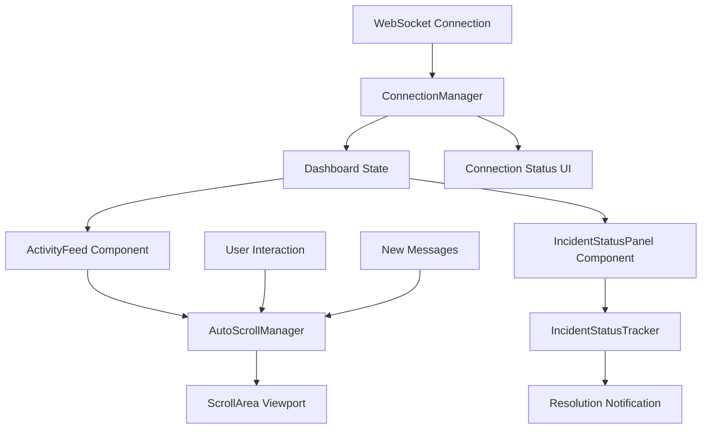

# Design Document

## Overview

This design document outlines the technical approach for implementing critical UX improvements to the Autonomous Incident Commander dashboard. The improvements focus on auto-scrolling activity feeds, clear incident resolution indicators, enhanced visual feedback, connection resilience, and performance optimization. The solution builds upon the existing React/TypeScript dashboard with Framer Motion animations and WebSocket connectivity.

## Architecture

### Component Architecture

The dashboard improvements will enhance existing components and introduce new utility components:

```
dashboard/src/components/
├── ActivityFeed.tsx (Enhanced)
├── IncidentStatusPanel.tsx (Enhanced)
├── RefinedDashboard.tsx (Enhanced)
├── utils/
│   ├── AutoScrollManager.ts (New)
│   ├── ConnectionManager.ts (New)
│   └── IncidentStatusTracker.ts (New)
└── hooks/
    ├── useAutoScroll.ts (New)
    ├── useWebSocketConnection.ts (Enhanced)
    └── useIncidentStatus.ts (New)
```

### Data Flow Architecture



## Components and Interfaces

### AutoScrollManager Class

```typescript
interface AutoScrollConfig {
  threshold: number; // Distance from bottom to pause auto-scroll
  resumeDelay: number; // Delay before resuming after user scroll
  smoothScroll: boolean; // Enable smooth scrolling
  maxScrollSpeed: number; // Maximum scroll speed for performance
}

interface ScrollState {
  isAutoScrollEnabled: boolean;
  isUserScrolling: boolean;
  isNearBottom: boolean;
  lastScrollPosition: number;
  messageCount: number;
}

class AutoScrollManager {
  private config: AutoScrollConfig;
  private state: ScrollState;
  private scrollContainer: HTMLElement | null;
  private resumeTimer: number | null;

  constructor(config: AutoScrollConfig);

  // Core methods
  public attachToContainer(container: HTMLElement): void;
  public detachFromContainer(): void;
  public scrollToBottom(smooth?: boolean): void;
  public pauseAutoScroll(): void;
  public resumeAutoScroll(): void;

  // Event handlers
  private handleScroll(): void;
  private handleNewMessage(): void;
  private handleUserInteraction(): void;

  // State management
  public getState(): ScrollState;
  public isNearBottom(): boolean;
  public shouldAutoScroll(): boolean;
}
```

### IncidentStatusTracker Class

```typescript
interface IncidentStatus {
  id: string;
  phase:
    | "detection"
    | "diagnosis"
    | "prediction"
    | "resolution"
    | "communication"
    | "resolved";
  progress: number; // 0-100
  startTime: Date;
  estimatedCompletion?: Date;
  isComplete: boolean;
  resolutionTime?: number;
}

interface StatusTransition {
  from: string;
  to: string;
  timestamp: Date;
  duration: number;
}

class IncidentStatusTracker {
  private currentIncident: IncidentStatus | null;
  private statusHistory: StatusTransition[];
  private completionCallbacks: Array<(incident: IncidentStatus) => void>;

  constructor();

  // Status management
  public updateIncidentStatus(update: Partial<IncidentStatus>): void;
  public markIncidentResolved(resolutionTime: number): void;
  public clearIncident(): void;

  // Progress tracking
  public calculateProgress(): number;
  public estimateCompletion(): Date | null;
  public getPhaseProgress(phase: string): number;

  // Event handling
  public onIncidentResolved(callback: (incident: IncidentStatus) => void): void;
  public getStatusHistory(): StatusTransition[];
}
```

### ConnectionManager Class

```typescript
interface ConnectionConfig {
  wsUrl: string;
  reconnectInterval: number;
  maxReconnectAttempts: number;
  heartbeatInterval: number;
  connectionTimeout: number;
}

interface ConnectionState {
  status: "connecting" | "connected" | "disconnected" | "error";
  lastConnected: Date | null;
  reconnectAttempts: number;
  latency: number;
  messageQueue: any[];
}

class ConnectionManager {
  private config: ConnectionConfig;
  private state: ConnectionState;
  private websocket: WebSocket | null;
  private heartbeatTimer: number | null;
  private reconnectTimer: number | null;

  constructor(config: ConnectionConfig);

  // Connection management
  public connect(): Promise<void>;
  public disconnect(): void;
  public reconnect(): Promise<void>;

  // Message handling
  public sendMessage(message: any): void;
  public queueMessage(message: any): void;
  public processMessageQueue(): void;

  // Health monitoring
  public startHeartbeat(): void;
  public stopHeartbeat(): void;
  public measureLatency(): Promise<number>;

  // Event handlers
  public onConnectionChange(callback: (state: ConnectionState) => void): void;
  public onMessage(callback: (message: any) => void): void;
}
```

## Data Models

### Enhanced Activity Feed Message

```typescript
interface AgentAction {
  id: string;
  agent_type:
    | "detection"
    | "diagnosis"
    | "prediction"
    | "resolution"
    | "communication";
  title: string;
  description: string;
  timestamp: string;
  confidence?: number;
  status: "pending" | "in_progress" | "completed" | "failed";
  details?: Record<string, any>;
  duration?: number;
  impact?: string;

  // New fields for enhanced UX
  isNew?: boolean; // Flag for highlighting new messages
  priority?: "low" | "medium" | "high" | "critical";
  category?: "system" | "user" | "agent" | "notification";
}
```

### Incident Resolution Status

```typescript
interface IncidentResolution {
  incidentId: string;
  isResolved: boolean;
  resolutionTime: number; // in seconds
  totalPhases: number;
  completedPhases: number;
  currentPhase?: string;

  // Resolution details
  resolutionSummary?: string;
  actionsPerformed: string[];
  businessImpact: {
    costSaved: number;
    downtime: number;
    affectedUsers: number;
  };

  // Visual state
  showCelebration: boolean;
  celebrationDuration: number;
  fadeOutDelay: number;
}
```

### WebSocket Message Types

```typescript
interface WebSocketMessage {
  type:
    | "incident_started"
    | "agent_action"
    | "incident_resolved"
    | "phase_completed"
    | "heartbeat";
  timestamp: string;
  data: any;
}

interface IncidentStartedMessage extends WebSocketMessage {
  type: "incident_started";
  data: {
    incident: Incident;
    estimatedDuration: number;
  };
}

interface AgentActionMessage extends WebSocketMessage {
  type: "agent_action";
  data: {
    action: AgentAction;
    incidentId: string;
  };
}

interface IncidentResolvedMessage extends WebSocketMessage {
  type: "incident_resolved";
  data: {
    incidentId: string;
    resolutionTime: number;
    summary: string;
    businessImpact: any;
  };
}
```

## Error Handling

### Auto-Scroll Error Recovery

```typescript
class AutoScrollErrorHandler {
  private static handleScrollError(error: Error, context: string): void {
    console.warn(`Auto-scroll error in ${context}:`, error);

    // Fallback to basic scrolling
    try {
      const container = document.querySelector("[data-scroll-container]");
      if (container) {
        container.scrollTop = container.scrollHeight;
      }
    } catch (fallbackError) {
      console.error("Fallback scroll failed:", fallbackError);
    }
  }

  private static handlePerformanceIssue(messageCount: number): void {
    if (messageCount > 1000) {
      // Implement message pruning
      console.warn(
        "High message count detected, implementing performance optimizations"
      );
    }
  }
}
```

### Connection Error Handling

```typescript
class ConnectionErrorHandler {
  private static handleConnectionError(
    error: Event,
    manager: ConnectionManager
  ): void {
    console.error("WebSocket connection error:", error);

    // Update UI to show disconnected state
    manager.updateConnectionStatus("error");

    // Attempt reconnection with exponential backoff
    manager.scheduleReconnect();
  }

  private static handleMessageError(error: Error, message: any): void {
    console.error("Message processing error:", error, message);

    // Queue message for retry if appropriate
    if (this.isRetryableError(error)) {
      // Add to retry queue
    }
  }
}
```

## Testing Strategy

### Unit Tests

```typescript
// AutoScrollManager Tests
describe("AutoScrollManager", () => {
  test("should auto-scroll to bottom when new messages arrive");
  test("should pause auto-scroll when user scrolls up");
  test("should resume auto-scroll when user returns to bottom");
  test("should handle rapid message bursts without performance issues");
  test("should maintain scroll position during container resize");
});

// IncidentStatusTracker Tests
describe("IncidentStatusTracker", () => {
  test("should track incident progress through all phases");
  test("should calculate accurate completion estimates");
  test("should trigger resolution callbacks when incident completes");
  test("should handle phase transitions correctly");
  test("should maintain status history");
});

// ConnectionManager Tests
describe("ConnectionManager", () => {
  test("should establish WebSocket connection successfully");
  test("should handle connection failures gracefully");
  test("should queue messages during disconnection");
  test("should process queued messages after reconnection");
  test("should measure connection latency accurately");
});
```

### Integration Tests

```typescript
// Dashboard Integration Tests
describe("Dashboard Integration", () => {
  test("should display incident resolution notification");
  test("should auto-scroll activity feed during incident");
  test("should handle WebSocket disconnection gracefully");
  test("should synchronize state across multiple components");
  test("should maintain performance with high message frequency");
});
```

### Performance Tests

```typescript
// Performance Benchmarks
describe("Performance Tests", () => {
  test("should handle 100+ messages per second without lag");
  test("should maintain 60fps during animations");
  test("should limit memory usage during long sessions");
  test("should optimize DOM updates for large message lists");
});
```

## Implementation Plan

### Phase 1: Auto-Scroll Enhancement

1. Create AutoScrollManager utility class
2. Implement useAutoScroll hook
3. Enhance ActivityFeed component with auto-scroll logic
4. Add scroll position indicators and controls
5. Test with rapid message scenarios

### Phase 2: Incident Resolution Status

1. Create IncidentStatusTracker utility class
2. Implement useIncidentStatus hook
3. Enhance IncidentStatusPanel with resolution indicators
4. Add celebration animations and notifications
5. Implement resolution timeline visualization

### Phase 3: Connection Resilience

1. Create ConnectionManager utility class
2. Enhance useWebSocketConnection hook
3. Add connection status indicators to UI
4. Implement message queuing and replay
5. Add reconnection logic with exponential backoff

### Phase 4: Visual Enhancements

1. Add smooth transitions between incident phases
2. Implement progress indicators and timers
3. Enhance agent completion animations
4. Add conflict resolution visualizations
5. Optimize animation performance

### Phase 5: Performance Optimization

1. Implement efficient DOM updates
2. Add message list virtualization if needed
3. Optimize WebSocket message handling
4. Add performance monitoring and metrics
5. Implement memory leak prevention

## Security Considerations

### WebSocket Security

- Validate all incoming WebSocket messages
- Implement message rate limiting
- Sanitize message content before display
- Use secure WebSocket connections (WSS) in production

### DOM Security

- Prevent XSS through proper content sanitization
- Validate scroll container references
- Implement safe DOM manipulation practices
- Use Content Security Policy headers

## Performance Considerations

### Memory Management

- Implement message list pruning for long sessions
- Use React.memo for expensive components
- Optimize re-render cycles with proper dependencies
- Clean up event listeners and timers

### Scroll Performance

- Use requestAnimationFrame for smooth scrolling
- Implement scroll throttling for performance
- Optimize scroll event handlers
- Consider virtual scrolling for very large lists

### Animation Performance

- Use CSS transforms for better performance
- Implement animation frame limiting
- Optimize Framer Motion configurations
- Use will-change CSS property appropriately
