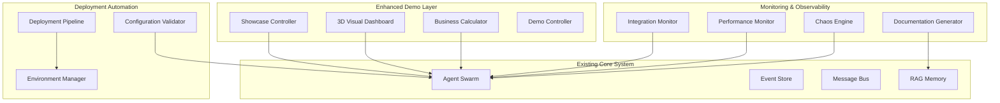

# Design Document

## Overview

This design document outlines the implementation of remaining high-priority enhancements for the Autonomous Incident Commander system. The enhancements focus on maximizing demo impact, ensuring production deployment readiness, and providing comprehensive integration showcase capabilities. The design leverages the existing 98% complete system architecture while adding strategic enhancements that demonstrate technical excellence and business value.

## Architecture

### System Enhancement Architecture

The enhancements follow a modular approach that integrates seamlessly with the existing multi-agent system:



### Integration Points

The enhancements integrate with existing system components through well-defined interfaces:

- **Showcase Controller**: Aggregates data from all agents and services
- **3D Visual Dashboard**: Connects to WebSocket manager for real-time updates
- **Business Calculator**: Integrates with incident lifecycle manager for ROI calculations
- **Deployment Pipeline**: Uses existing CDK stacks with enhanced automation
- **Monitoring Services**: Leverage existing observability infrastructure

## Components and Interfaces

### 1. Unified Showcase Controller

**Purpose**: Provide a single endpoint that demonstrates all system capabilities for judges and stakeholders.

**Interface Design**:

```python
class ShowcaseController:
    async def generate_full_showcase(self, incident_id: str) -> ShowcaseResponse:
        """Generate comprehensive system capability demonstration"""

    async def get_integration_status(self) -> IntegrationStatus:
        """Validate all AWS service integrations are operational"""

    async def execute_demo_scenario(self, scenario: DemoScenario) -> DemoResult:
        """Execute predefined demo scenarios with controlled outcomes"""
```

**Data Models**:

```python
@dataclass
class ShowcaseResponse:
    incident_analysis: IncidentAnalysis
    q_insights: AmazonQAnalysis
    nova_action_plan: NovaActPlan
    strands_coordination: StrandsMetrics
    business_impact: BusinessImpactReport
    predictive_analysis: PredictionResults
    performance_metrics: PerformanceSnapshot
    execution_time: float
    timestamp: datetime
```

### 2. Enhanced 3D Visual Dashboard

**Purpose**: Provide compelling real-time visualization of multi-agent coordination and system operations.

**Interface Design**:

```python
class VisualDashboard:
    async def initialize_3d_scene(self) -> SceneConfiguration:
        """Initialize 3D visualization environment"""

    async def update_agent_positions(self, agent_states: Dict[str, AgentState]) -> None:
        """Update 3D positions and states of agents"""

    async def visualize_agent_communication(self, message: AgentMessage) -> None:
        """Show visual connections and data flow between agents"""

    async def animate_incident_resolution(self, incident: Incident) -> None:
        """Animate the complete incident resolution process"""
```

**3D Scene Components**:

- Agent nodes with state-based colors and animations
- Connection lines showing message flow between agents
- Incident visualization as central focal point
- Performance metrics overlay with real-time updates
- Interactive controls for demo manipulation

### 3. Automated Deployment Pipeline

**Purpose**: Enable reliable, automated deployment to staging and production environments.

**Interface Design**:

```python
class DeploymentPipeline:
    async def deploy_environment(self, env: Environment) -> DeploymentResult:
        """Deploy complete system to specified environment"""

    async def configure_bedrock_agents(self, env: Environment) -> ConfigurationResult:
        """Configure Bedrock agents with proper IAM roles"""

    async def validate_deployment(self, env: Environment) -> ValidationResult:
        """Validate all services are operational after deployment"""

    async def rollback_deployment(self, env: Environment) -> RollbackResult:
        """Rollback to previous stable deployment"""
```

**Deployment Stages**:

1. Infrastructure provisioning (CDK deployment)
2. Bedrock agent configuration
3. Service integration validation
4. Health check execution
5. Performance baseline establishment

### 4. Business Impact Calculator Enhancement

**Purpose**: Provide comprehensive ROI analysis and industry-specific business impact calculations.

**Interface Design**:

```python
class BusinessImpactCalculator:
    async def calculate_industry_roi(self, industry: Industry, incident: Incident) -> ROIAnalysis:
        """Calculate industry-specific ROI projections"""

    async def generate_executive_report(self, timeframe: Timeframe) -> ExecutiveReport:
        """Generate executive-level business impact report"""

    async def compare_traditional_response(self, incident: Incident) -> ComparisonReport:
        """Compare against traditional incident response approaches"""

    async def export_business_data(self, format: ExportFormat) -> ExportResult:
        """Export business impact data in specified format"""
```

**Industry-Specific Calculations**:

- E-commerce: Revenue per minute, conversion impact, customer retention
- Financial Services: Transaction volume impact, compliance costs, reputation risk
- SaaS Platforms: Subscriber churn, service credits, competitive impact
- Healthcare: Patient safety, regulatory compliance, operational efficiency

### 5. Comprehensive Monitoring System

**Purpose**: Provide real-time monitoring and observability for all system integrations and performance metrics.

**Interface Design**:

```python
class IntegrationMonitor:
    async def monitor_aws_services(self) -> ServiceHealthReport:
        """Monitor health of all AWS service integrations"""

    async def track_guardrail_decisions(self) -> GuardrailMetrics:
        """Track and report guardrail policy enforcement"""

    async def collect_agent_telemetry(self) -> AgentTelemetryReport:
        """Collect comprehensive agent performance metrics"""

    async def generate_diagnostic_report(self, service: str) -> DiagnosticReport:
        """Generate detailed diagnostic information for service failures"""
```

**Monitoring Capabilities**:

- Real-time health dashboards for all integrations
- Performance trend analysis and alerting
- Guardrail decision tracking and compliance reporting
- Agent execution statistics and optimization recommendations

### 6. Chaos Engineering Framework

**Purpose**: Validate system resilience through comprehensive failure simulation and recovery testing.

**Interface Design**:

```python
class ChaosEngineeringFramework:
    async def execute_chaos_test(self, test_scenario: ChaosScenario) -> ChaosResult:
        """Execute specific chaos engineering test scenario"""

    async def simulate_byzantine_failure(self, agent_count: int) -> ByzantineTestResult:
        """Simulate Byzantine node failures and verify consensus"""

    async def test_connection_exhaustion(self) -> ConnectionTestResult:
        """Test system behavior under connection pool exhaustion"""

    async def validate_recovery_procedures(self) -> RecoveryValidationResult:
        """Validate automated recovery procedures and measure RTO"""
```

**Test Scenarios**:

- Network latency and partition simulation
- Database failover and recovery testing
- Memory leak and resource exhaustion
- Service dependency failures
- Multi-region disaster scenarios

## Data Models

### Core Enhancement Models

```python
@dataclass
class ShowcaseResponse:
    incident_analysis: IncidentAnalysis
    q_insights: AmazonQAnalysis
    nova_action_plan: NovaActPlan
    strands_coordination: StrandsMetrics
    business_impact: BusinessImpactReport
    predictive_analysis: PredictionResults
    performance_metrics: PerformanceSnapshot
    execution_time: float
    timestamp: datetime

@dataclass
class DeploymentResult:
    environment: Environment
    status: DeploymentStatus
    resources_created: List[AWSResource]
    validation_results: ValidationResult
    rollback_plan: RollbackPlan
    deployment_time: float

@dataclass
class BusinessImpactReport:
    industry: Industry
    roi_projection: ROIProjection
    cost_savings: CostSavings
    performance_improvement: PerformanceMetrics
    competitive_advantage: CompetitiveAnalysis
    executive_summary: ExecutiveSummary

@dataclass
class ChaosResult:
    test_scenario: ChaosScenario
    system_behavior: SystemBehavior
    recovery_time: float
    resilience_score: float
    recommendations: List[ResilienceRecommendation]
```

### Integration Status Models

```python
@dataclass
class IntegrationStatus:
    amazon_q: ServiceStatus
    nova_act: ServiceStatus
    strands_sdk: ServiceStatus
    titan_embeddings: ServiceStatus
    bedrock_agents: ServiceStatus
    guardrails: ServiceStatus
    overall_health: HealthScore

@dataclass
class ServiceStatus:
    service_name: str
    is_operational: bool
    response_time: float
    error_rate: float
    last_health_check: datetime
    diagnostic_info: Optional[DiagnosticInfo]
```

## Error Handling

### Graceful Degradation Strategy

The enhanced system implements comprehensive error handling with graceful degradation:

```python
class EnhancementErrorHandler:
    async def handle_showcase_failure(self, error: Exception) -> PartialShowcaseResponse:
        """Provide partial showcase when some services are unavailable"""

    async def handle_deployment_failure(self, error: DeploymentError) -> RecoveryPlan:
        """Generate recovery plan for deployment failures"""

    async def handle_visualization_error(self, error: VisualizationError) -> FallbackDisplay:
        """Provide fallback visualization when 3D rendering fails"""
```

**Error Handling Principles**:

- Never fail completely - always provide partial functionality
- Clear error reporting with actionable recovery steps
- Automatic fallback to simpler alternatives
- Comprehensive logging for debugging and improvement
- User-friendly error messages for demo scenarios

### Resilience Patterns

1. **Circuit Breaker**: Prevent cascade failures in integration calls
2. **Retry with Backoff**: Handle transient failures gracefully
3. **Bulkhead**: Isolate failures to prevent system-wide impact
4. **Timeout**: Prevent hanging operations during demos
5. **Fallback**: Provide alternative responses when services are unavailable

## Testing Strategy

### Comprehensive Testing Approach

The testing strategy covers all enhancement areas with automated validation:

#### 1. Showcase Endpoint Testing

```python
class TestShowcaseController:
    async def test_full_showcase_generation(self):
        """Test complete showcase response generation"""

    async def test_partial_service_availability(self):
        """Test showcase with some services unavailable"""

    async def test_performance_under_load(self):
        """Test showcase performance with concurrent requests"""
```

#### 2. Deployment Pipeline Testing

```python
class TestDeploymentPipeline:
    async def test_staging_deployment(self):
        """Test complete staging environment deployment"""

    async def test_rollback_procedures(self):
        """Test deployment rollback functionality"""

    async def test_configuration_validation(self):
        """Test service configuration validation"""
```

#### 3. Visual Dashboard Testing

```python
class TestVisualDashboard:
    async def test_3d_scene_initialization(self):
        """Test 3D scene setup and configuration"""

    async def test_real_time_updates(self):
        """Test real-time agent state updates"""

    async def test_performance_under_load(self):
        """Test visualization performance with high update frequency"""
```

#### 4. Integration Testing

```python
class TestIntegrationMonitoring:
    async def test_service_health_monitoring(self):
        """Test AWS service health monitoring"""

    async def test_guardrail_tracking(self):
        """Test guardrail decision tracking"""

    async def test_diagnostic_reporting(self):
        """Test diagnostic report generation"""
```

#### 5. Chaos Engineering Testing

```python
class TestChaosEngineering:
    async def test_network_partition_simulation(self):
        """Test system behavior under network partitions"""

    async def test_byzantine_failure_handling(self):
        """Test Byzantine fault tolerance mechanisms"""

    async def test_recovery_time_measurement(self):
        """Test and measure recovery time objectives"""
```

### Performance Testing

**Load Testing Scenarios**:

- Concurrent showcase requests (100+ simultaneous judges)
- High-frequency visualization updates (60fps sustained)
- Deployment pipeline under multiple environment requests
- Chaos testing with production-level load

**Performance Targets**:

- Showcase endpoint: <30 seconds response time
- 3D visualization: 60fps with <16ms frame time
- Deployment pipeline: <10 minutes for complete environment
- Integration monitoring: <5 seconds for health checks

### Demo Validation Testing

**Demo Scenario Testing**:

- Judge interaction workflows
- Failure recovery demonstrations
- Performance metric showcases
- Business impact calculations

**Acceptance Criteria Validation**:

- All requirements must pass automated tests
- Performance targets must be consistently met
- Error handling must provide graceful degradation
- Documentation must be automatically generated and validated

## Implementation Considerations

### Development Approach

1. **Incremental Enhancement**: Build on existing 98% complete system
2. **Backward Compatibility**: Ensure existing functionality remains intact
3. **Modular Design**: Each enhancement can be developed and deployed independently
4. **Performance First**: Optimize for demo performance and judge experience
5. **Production Ready**: All enhancements must meet production quality standards

### Integration Strategy

1. **Existing API Compatibility**: Maintain all existing endpoints
2. **WebSocket Enhancement**: Extend existing WebSocket for 3D visualization
3. **Database Schema**: Extend existing tables without breaking changes
4. **Configuration Management**: Use existing environment variable patterns
5. **Monitoring Integration**: Leverage existing observability infrastructure

### Deployment Considerations

1. **Zero Downtime**: All enhancements must support rolling deployment
2. **Feature Flags**: Use feature flags for gradual rollout
3. **Rollback Safety**: All changes must be safely reversible
4. **Environment Parity**: Ensure consistency across dev/staging/production
5. **Security Compliance**: Maintain existing security standards and practices
