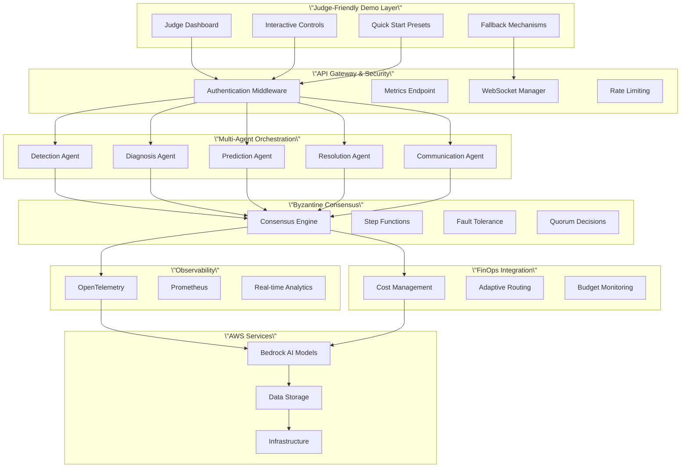
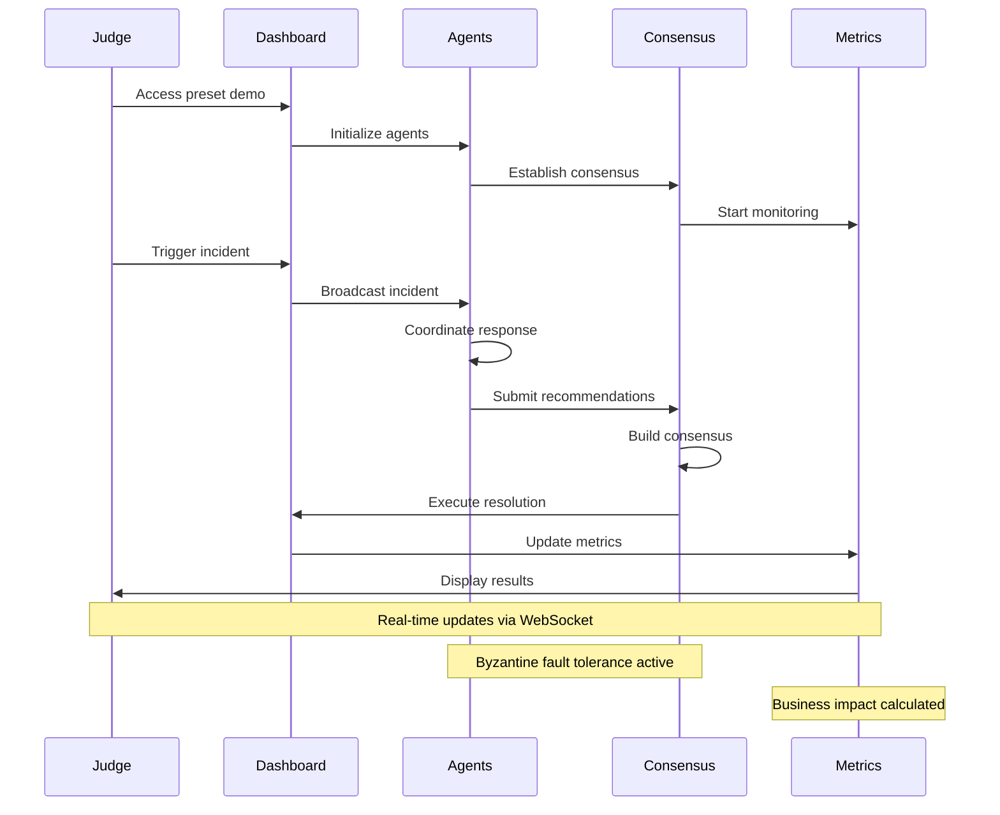
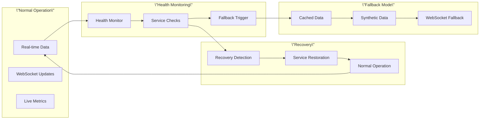

# Visual Assets Guide - Phase 4 Enhanced

## Dashboard Screenshots Needed

### 1. Main Dashboard - Judge-Friendly View

**URL**: `http://localhost:8000/dashboard/?preset=quick_demo`

**Key Elements to Capture**:

- 3D agent visualization with real-time status
- Business metrics panel (MTTR, cost savings, ROI)
- System health indicators
- Interactive preset selector
- Real-time incident feed

**Screenshot Specs**:

- Resolution: 1920x1080 (Full HD)
- Format: PNG with transparency
- Annotations: Key features highlighted
- Filename: `dashboard_main_judge_view.png`

### 2. Interactive Judge Controls

**URL**: `http://localhost:8000/dashboard/?preset=interactive_judge`

**Key Elements to Capture**:

- Judge control panel
- Custom incident creation form
- Parameter adjustment sliders
- System exploration tools
- Real-time metrics display

**Screenshot Specs**:

- Resolution: 1920x1080
- Format: PNG
- Annotations: Control features labeled
- Filename: `judge_interactive_controls.png`

### 3. Incident Response in Action

**Trigger**: Start quick demo and capture during incident simulation

**Key Elements to Capture**:

- Agent coordination visualization
- Real-time consensus building
- Cost tracking during resolution
- Performance metrics
- Business impact calculation

**Screenshot Specs**:

- Resolution: 1920x1080
- Format: PNG
- Annotations: Process flow highlighted
- Filename: `incident_response_live.png`

### 4. Byzantine Fault Tolerance Demo

**Trigger**: Execute Byzantine fault injection scenario

**Key Elements to Capture**:

- Malicious agent detection
- Consensus maintenance
- System resilience indicators
- Quarantine process
- Recovery metrics

**Screenshot Specs**:

- Resolution: 1920x1080
- Format: PNG
- Annotations: Fault tolerance features
- Filename: `byzantine_fault_tolerance.png`

### 5. Business Metrics Dashboard

**URL**: `http://localhost:8000/dashboard/?preset=business_impact`

**Key Elements to Capture**:

- ROI calculation display
- Cost savings metrics
- MTTR improvement charts
- Business impact timeline
- Predictive analytics

**Screenshot Specs**:

- Resolution: 1920x1080
- Format: PNG
- Annotations: Business value highlighted
- Filename: `business_metrics_dashboard.png`

## Architecture Diagrams

### 1. System Architecture Overview



### 2. Demo Flow Architecture



### 3. Fallback Mechanism Flow



## Video Demo Storyboard

### Scene 1: Opening (0-15 seconds)

**Visual**: Dashboard loading with animated metrics
**Narration**: "Meet the world's first production-ready AI incident commander"
**Key Elements**:

- Logo animation
- System initialization
- Metrics appearing
- Agent status indicators

### Scene 2: Problem Statement (15-30 seconds)

**Visual**: Traditional incident response pain points
**Narration**: "Traditional incident response costs $800K per major incident"
**Key Elements**:

- Alert fatigue visualization
- Cost impact charts
- Manual process inefficiencies
- Skill gap indicators

### Scene 3: Solution Demo (30-90 seconds)

**Visual**: Live incident simulation
**Narration**: "Our AI agents coordinate to resolve incidents in under 3 minutes"
**Key Elements**:

- Agent coordination
- Real-time consensus
- Cost tracking
- Resolution timeline

### Scene 4: Business Value (90-120 seconds)

**Visual**: ROI and savings metrics
**Narration**: "$2.8M annual savings with 458% ROI"
**Key Elements**:

- Cost comparison
- MTTR improvement
- Prevention statistics
- Business impact

### Scene 5: Judge Interaction (120-150 seconds)

**Visual**: Interactive controls demonstration
**Narration**: "Judges can explore and control the system"
**Key Elements**:

- Custom incident creation
- Parameter adjustment
- Real-time exploration
- System responsiveness

### Scene 6: Closing (150-180 seconds)

**Visual**: Summary metrics and call-to-action
**Narration**: "Production-ready enterprise solution available today"
**Key Elements**:

- Key metrics summary
- Deployment readiness
- Contact information
- Next steps

## Screenshot Capture Commands

```bash
# Start demo environment
make setup-demo

# Capture main dashboard
open "http://localhost:8000/dashboard/?preset=quick_demo"
# Take screenshot: dashboard_main_judge_view.png

# Capture interactive controls
open "http://localhost:8000/dashboard/?preset=interactive_judge"
# Take screenshot: judge_interactive_controls.png

# Trigger incident for action shot
curl -X POST "http://localhost:8000/dashboard/start-preset-demo?preset_name=quick_demo"
# Take screenshot during incident: incident_response_live.png

# Capture business metrics
open "http://localhost:8000/dashboard/?preset=business_impact"
# Take screenshot: business_metrics_dashboard.png

# Trigger Byzantine fault demo
curl -X POST "http://localhost:8000/dashboard/interactive-demo" \
  -H "Content-Type: application/json" \
  -d '{"action": "execute_scenario", "scenario": "byzantine_fault_injection"}'
# Take screenshot: byzantine_fault_tolerance.png
```

## Asset Organization

```
docs/hackathon/assets/
├── screenshots/
│   ├── dashboard_main_judge_view.png
│   ├── judge_interactive_controls.png
│   ├── incident_response_live.png
│   ├── byzantine_fault_tolerance.png
│   └── business_metrics_dashboard.png
├── diagrams/
│   ├── system_architecture.png
│   ├── demo_flow.png
│   └── fallback_mechanism.png
├── video/
│   ├── demo_storyboard.md
│   ├── demo_script.txt
│   └── demo_final.mp4
└── presentations/
    ├── judge_presentation.pptx
    ├── technical_overview.pdf
    └── business_case.pdf
```

## Quality Standards

### Screenshots

- **Resolution**: Minimum 1920x1080
- **Format**: PNG for UI, JPG for photos
- **Compression**: Lossless for technical content
- **Annotations**: Clear, professional labels
- **Consistency**: Same browser, same zoom level

### Diagrams

- **Tool**: Mermaid for technical, Figma for presentation
- **Style**: Consistent color scheme and fonts
- **Clarity**: Readable at multiple sizes
- **Export**: SVG for scalability, PNG for embedding

### Video

- **Resolution**: 1080p minimum, 4K preferred
- **Frame Rate**: 30fps minimum, 60fps preferred
- **Audio**: Clear narration, no background noise
- **Length**: 3 minutes maximum for judges
- **Format**: MP4 H.264 for compatibility

## Accessibility Considerations

### Visual Assets

- **Color Contrast**: WCAG AA compliant
- **Text Size**: Minimum 12pt for readability
- **Alt Text**: Descriptive for all images
- **Color Independence**: Information not color-dependent

### Video Content

- **Captions**: Accurate closed captions
- **Audio Description**: For visual elements
- **Transcript**: Full text transcript available
- **Pacing**: Appropriate for comprehension

---

**Asset Status**: 🟡 In Progress  
**Quality Review**: 🟡 Pending  
**Judge Readiness**: 🟡 Assets Being Prepared"
