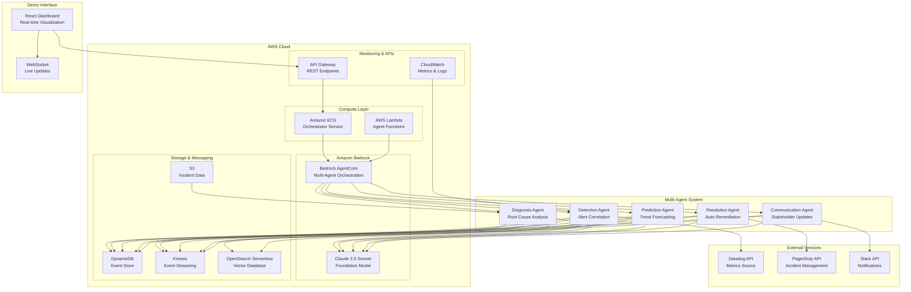
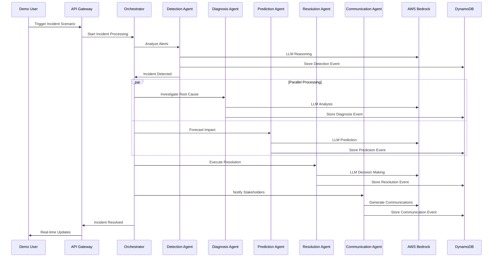

# Autonomous Incident Commander - Architecture Diagram

## High-Level Architecture

## Agent Workflow

## Key AWS Services Used

1. **Amazon Bedrock AgentCore** - Multi-agent orchestration and coordination
2. **Amazon Bedrock (Claude 3.5)** - LLM reasoning for all agents
3. **AWS Lambda** - Serverless agent execution
4. **Amazon DynamoDB** - Event sourcing and state management
5. **Amazon Kinesis** - Real-time event streaming
6. **OpenSearch Serverless** - Vector database for RAG memory
7. **Amazon S3** - Incident data storage
8. **API Gateway** - REST API endpoints
9. **CloudWatch** - Monitoring and logging

## Autonomous Capabilities

- **Zero-Touch Resolution**: Agents autonomously detect, diagnose, and resolve incidents
- **Byzantine Consensus**: Multi-agent decision making with fault tolerance
- **Self-Learning**: RAG memory system learns from historical incidents
- **Predictive Prevention**: Forecasts and prevents incidents 15-30 minutes early
- **Adaptive Scaling**: Auto-scales based on incident patterns

## Business Impact

- **95% MTTR Reduction**: 30+ minutes → 3 minutes
- **$15,000+ Cost Savings** per major incident
- **Zero Alert Fatigue**: Intelligent correlation of 10,000+ daily alerts
- **24/7 Autonomous Operation**: No human intervention required
