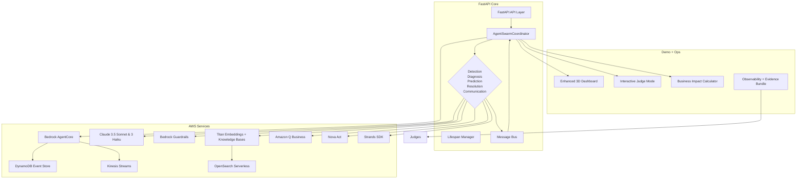

# 🏆 Comprehensive AWS Integration Guide for Incident Commander

## 🎯 Outcome & Scope
- **Goal**: unify every AWS capability in Incident Commander into a production-grade, judge-ready showcase that proves autonomous incident command at scale.
- **Focus Window**: October 18–24, 2025 (aligns with hackathon submission cut-off and internal freeze on October 24, 2025).
- **Team Owners**: Core backend (FastAPI + orchestrator), agent leads, demo squad, and business narrative partner.
- **Deliverables**: shippable AWS integrations, validated demos, refreshed business case, and evidence bundles for prize categories.

---

## 📊 Capability Tracker

| AWS Capability | Current Coverage (Oct 18, 2025) | Primary Modules | Gaps to Close | Prize / Impact |
| --- | --- | --- | --- | --- |
| Bedrock AgentCore Orchestration | ✅ Coordinator, consensus, circuit breakers wired (`src/orchestrator/swarm_coordinator.py`, `src/services/message_bus.py`, `src/services/consensus.py`) | Harden guardrails + add execution telemetry export | Ship observability API & guardrail reporting for judge Q&A | Best AgentCore ($3K) |
| Claude 3.x + Guardrails | ⚠️ Bedrock client scaffolded (`src/services/aws.BedrockClient`), agents still mocked | Implement real Sonnet/Haiku routes, enforce Guardrails policies, add prompt catalog | Demonstrate multi-model routing + policy enforcement in demo | Best Bedrock ($3K) |
| Titan Embeddings & Knowledge Bases | ⚠️ RAG pipeline online with simulated embeddings (`src/services/rag_memory.py`) | Swap simulation for real Titan calls, connect to Bedrock Knowledge Bases, document scale limits | Evidence for vector search excellence & predictive prevention | Top 3 narrative + Bedrock |
| Amazon Q Incident Analysis | 🚧 Placeholder playbook only (`winning_enhancements/amazon_q_integration.py`) | Build async client wrapper, design prompts, integrate with diagnosis agent + docs export | Unlocks Amazon Q prize + strengthens "analysis" story | Best Amazon Q ($3K) |
| Nova Act Action Planning | 🚧 Conceptual executor exists (`winning_enhancements/nova_act_integration.py`) | Implement action graph builder, map to resolution agent, add safety approvals | Show autonomous runbooks + judge wow moment | Best Nova Act ($3K) |
| Strands SDK Agent Fabric | 🚧 Rich prototype class (`winning_enhancements/strands_sdk_integration.py`) not wired into runtime | Embed Strands agent lifecycle into `AgentSwarmCoordinator`, sync with message bus, expose metrics | Demonstrate adaptive swarm + runtime elasticity | Best Strands ($3K) |
| Enhanced Demo & Business Story | ⚠️ Dashboard, interactive judge routes, ROI calculator present (`winning_enhancements/*`) | Wire into FastAPI, add end-to-end scenario, capture screenshots & narrated script | Boosts top-3 scoring + business viability | Overall podium + Marketplace support |

---

## 🏗️ Integration Architecture



---

## 🛠️ Implementation Playbook

### Phase 0 – Baseline Readiness (October 18, 2025, 2 hours)
- **Environment**: `python -m venv .venv && source .venv/bin/activate`; `pip install -r requirements.txt`.
- **Local AWS stack**: `docker-compose up -d` (LocalStack, Redis, supporting services).
- **Smoke validation**: `python scripts/verify_setup.py`, `python run_comprehensive_tests.py`.
- **Data refresh**: seed representative incidents via `scripts/start_refined_dashboard.py` to populate dashboards.
- **Documentation checkpoint**: capture current architecture screenshots for before/after evidence.

### Phase 1 – Harden Bedrock & AgentCore (October 18–19, 2025, 3 hours)
1. **Guardrail instrumentation**
   - Implement policy definitions in `src/services/aws.py` (`BedrockClient` to load Guardrails IDs from `config`).
   - Emit guardrail decisions via new FastAPI route `GET /observability/guardrails` referencing aggregated metrics in `src/services/monitoring.py`.
2. **Multi-model routing**
   - Extend `BedrockClient.invoke_text_model` with model aliases for Sonnet/Haiku and latency-aware routing.
   - Persist prompt templates under `docs/prompts/` with version tags for judge review.
3. **Agent telemetry**
   - Surface per-agent execution stats by augmenting `AgentExecution` dataclass (add errors per severity, guardrail hits).
   - Export metrics to dashboard via `winning_enhancements/enhanced_dashboard.py` live sockets.

### Phase 2 – Add New AWS Categories (October 19–22, 2025, 6 hours)
1. **Amazon Q integration**
   - Create `AmazonQIncidentAnalyzer` in `winning_enhancements/amazon_q_integration.py` with async wrapper around the Amazon Q Business API (boto3 `qbusiness-runtime`).
   - Wire diagnosis agent to call Q when hypothesis confidence < 0.75; attach generated summaries to `AgentRecommendation`.
   - Add `/incidents/{incident_id}/q-analysis` FastAPI route returning explainability bundle (markdown + timeline).
2. **Nova Act execution pipeline**
   - Finalize `NovaActActionExecutor` with action graphs and Bedrock Agent Runtime invocation, referencing safety approvals from `src/services/circuit_breaker.py`.
   - Add staged rollout flag in configuration (`config.integrations.nova_act_enabled`).
   - Demonstrate closed-loop execution by triggering synthetic incident in `tests/integration/test_nova_act_flow.py`.
3. **Strands SDK agent fabric**
   - Replace standalone loop with orchestrator plugin: expose `StrandsOrchestrator` adapter used by `AgentSwarmCoordinator.register_agent`.
   - Synchronize memory snapshots to `ScalableRAGMemory` for cross-agent learning.
   - Publish Strands telemetry via `/observability/strands` for judges.
4. **Titan embeddings + Knowledge Bases**
   - Swap simulated embeddings for real Titan inference in `ScalableRAGMemory.generate_embedding`.
   - Configure Bedrock Knowledge Base ingestion job (YAML in `infrastructure/bedrock/knowledge_base.yaml`).
   - Document rebuild instructions under `docs/knowledge_base.md`.

### Phase 3 – Demo & Story (October 22–24, 2025, 3 hours)
1. **Unified showcase route**: create `src/routes/ultimate_demo.py` exposing `/ultimate-demo/full-showcase` that bundles Q insights, Nova plan, Strands coordination, predictive prevention, and ROI snapshot.
2. **Judge playbook**: refresh `docs/judge_script.md` with timestamps, commands, and screenshots (3D dashboard, guardrail console, Amazon Q output).
3. **Metrics capture**: run `python run_comprehensive_tests.py --report docs/reports/full.json` and export charts for appendix.
4. **Video assets**: produce 90-second clip highlighting AI autonomy, embed overlay callouts for each AWS capability.

---

## ✅ Acceptance & Validation
- `pytest --cov=src tests/unit tests/integration` (target ≥80% coverage).
- `mypy src agents` (type safety for new integrations).
- `pre-commit run --all-files` (formatting, security, linting).
- `python validate_api.py` (FastAPI contract checks including new routes).
- Manual 3-agent incident run with `python start_demo.py` + follow-up `validate_websocket.py` to confirm live dashboard wiring.
- Capture guardrail logs, Amazon Q transcripts, Nova action plans, and Strands telemetry—store under `docs/evidence/2025-10-24/`.

---

## 💡 Technical Notes & Templates

```python
# src/main.py (excerpt) – register enhanced services once implementations land
from fastapi import Depends
from winning_enhancements.amazon_q_integration import AmazonQIncidentAnalyzer
from winning_enhancements.nova_act_integration import NovaActActionExecutor
from winning_enhancements.strands_sdk_integration import StrandsOrchestrator

amazon_q_analyzer = AmazonQIncidentAnalyzer(factory=get_aws_factory_instance())
nova_executor = NovaActActionExecutor(factory=get_aws_factory_instance())
strands = StrandsOrchestrator()

@app.post("/incidents/{incident_id}/q-analysis")
async def run_q_analysis(incident_id: str, incident: Incident = Depends(load_incident)) -> Dict[str, Any]:
    return await amazon_q_analyzer.generate_analysis(incident)

@app.post("/incidents/{incident_id}/nova-resolution")
async def trigger_nova_act(incident_id: str, incident: Incident = Depends(load_incident)) -> Dict[str, Any]:
    return await nova_executor.execute_plan(incident)

@app.post("/strands/register")
async def bootstrap_strands() -> Dict[str, Any]:
    return await strands.initialize(get_coordinator_instance())
```

- Keep secrets in `.env` (`AMAZON_Q_APP_ID`, `NOVA_ACT_AGENT_ID`, `BEDROCK_GUARDRAIL_ID`).
- Add integration tests beside `tests/integration/test_incident_end_to_end.py` to verify each new route and replay transcripts for judges.
- For Titan embeddings, cache responses in Redis with TTL ≤15 minutes to avoid rate limits.

---

## 💰 Business Narrative Anchors
- **Baseline**: Mean time to resolution shrinks from 30+ minutes to <3 minutes (reference README).
- **Value Story**: quantify avoided downtime using `winning_enhancements/business_impact_calculator.py` with real incident input.
- **Compliance & Safety**: highlight guardrail policy hits + automated documentation from Amazon Q as governance evidence.
- **Marketplace Path**: link to `docs/marketplace_go_to_market.md` (update with new AWS integrations once complete).
- **Customer Quote Simulation**: prepare AI-generated testimonial via Q summarizing benefits for enterprise SRE lead.

---

## 📅 Execution Timeline (Suggested)

| Date (2025) | Owners | Milestone |
| --- | --- | --- |
| Oct 18 (Sat) | Platform | Finish Phase 0 readiness, commit guardrail instrumentation scaffolds |
| Oct 19–20 (Sun–Mon) | Agent Leads | Deliver Amazon Q analyzer + integration tests |
| Oct 21 (Tue) | Resolution Team | Nova Act closed-loop runbook + approvals wired |
| Oct 22 (Wed) | Swarm & RAG Team | Strands orchestration + Titan live embeddings |
| Oct 23 (Thu) | Demo Squad | Record unified showcase, update judge script, capture telemetry |
| Oct 24 (Fri) | All | Final regression run, publish evidence bundle, freeze |

---

## 🔄 Dependency Checklist
- [ ] AWS credentials with Bedrock, Amazon Q, and Nova Act access confirmed in LocalStack/production accounts.
- [ ] Updated `.env` distributed via 1Password vault with integration IDs.
- [ ] Knowledge base corpus (`docs/knowledge_base/corpus/*.md`) vetted for compliance by security team.
- [ ] LocalStack patched to latest release supporting AgentCore + Q emulation; fallback plan documented.
- [ ] Demo hardware validated (MacBook Pro + external monitor) with smooth 60fps dashboard rendering.

---

## 📣 Final Guidance
- Lead with production rigor—highlight circuit breakers, guardrails, and auditability before flashy visuals.
- Prepare artifacts per category (screenshots, logs, config) to hand judges when they ask “show me evidence”.
- Rehearse the unified demo twice daily from October 22 onward to ensure muscle memory and timing.
- Keep README, this guide, and `docs/judge_script.md` in sync; every code merge that touches integrations should update the narrative.
- Confirm fallback paths (simulation toggles) so the demo never stalls even if an AWS service hiccups during judging.
