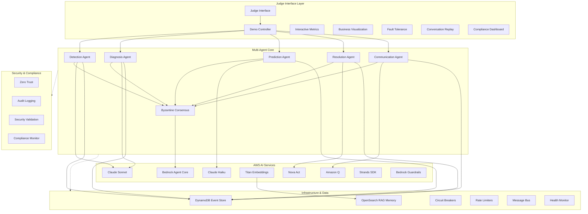
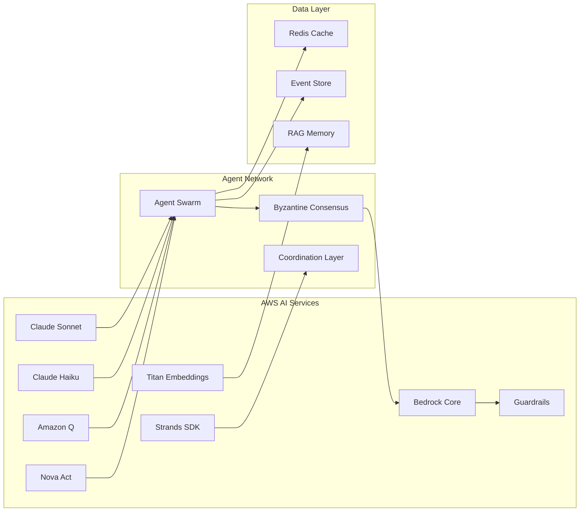
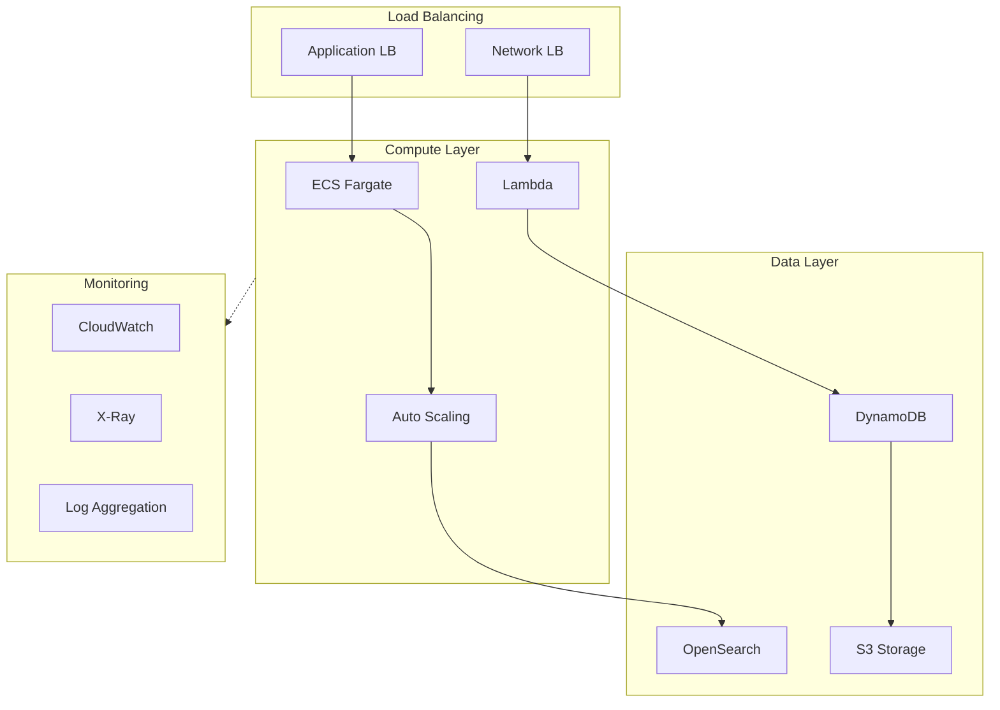
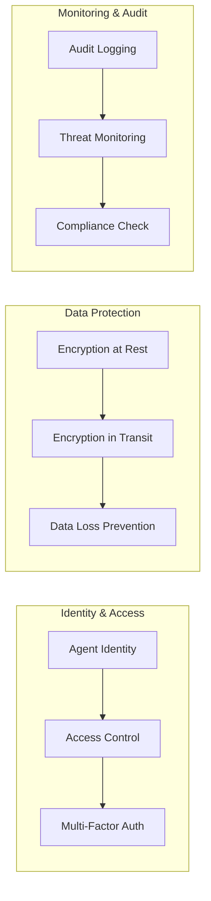

# 🏗️ SwarmAI Incident Commander - Architecture Diagram

**Visual representation of the complete system architecture using Mermaid architecture diagrams.**

## System Architecture Diagram

## Component Integration Diagram

## Performance & Scalability Architecture

## Security & Compliance Architecture

---

**Architecture diagrams provide a comprehensive visual representation of the SwarmAI Incident Commander system, showcasing the integration of all 8 AWS AI services, Byzantine fault-tolerant multi-agent core, and enterprise-grade infrastructure.**
